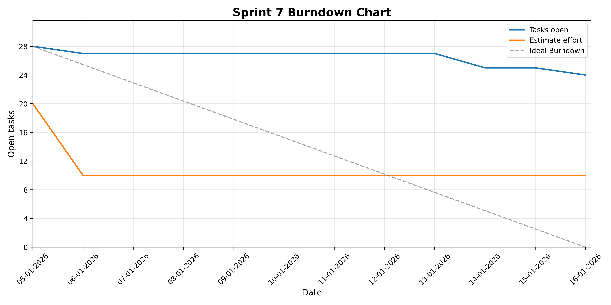

# gh-projects-charts

Generates a burndown chart from GitHub Projects issues that carry the **task** label. Issues are filtered by the configured sprint date range and, when set, by the Sprint field. For each day in the sprint it plots two metrics: the total time estimate of open issues (`estimate`) and the number of open issues (`closed`).

## Setup

1. Go to [GitHub → Settings → Tokens](https://github.com/settings/tokens) and create a new personal access token.
2. Enable the **`project`** and **`repo`** scopes so the tool can read data from the GitHub API.
3. Add the token to a `.env` file at the root of this repository:

```
GITHUB_TOKEN=<your_token>
```

## Usage

Configure the chart by editing [config.json](src/resources/config.json):

| Field | Description |
|---|---|
| `user_name` | Your GitHub username. |
| `project_number` | The project number from the URL: `https://github.com/users/<username>/projects/<project_number>`. |
| `max_items` | Maximum number of issues to fetch from the project. |
| `calculators` | Statistics to plot — `estimate` (total time estimate) and/or `closed` (open issue count). |
| `sprint_data.sprint` | Sprint number to filter on. |
| `sprint_data.start_date` | Sprint start date (inclusive). |
| `sprint_data.end_date` | Sprint end date (inclusive). |
| `wants_to_display` | Set to `true` to open the chart in a matplotlib window. |
| `wants_to_save` | Set to `true` to save the chart to disk. |

> **Note:** If the Sprint field is not set on an issue, it will be included based on date overlap alone.

Once the config is set, run the tool using one of the methods below.

**Using uv (recommended):**
```zsh
cd src
uv run main.py
```

**Using the standard Python interpreter:**
Install dependencies
```zsh
pip install -e .
```

Run from the src directory
```zsh
cd src
python main.py
```


## Example


